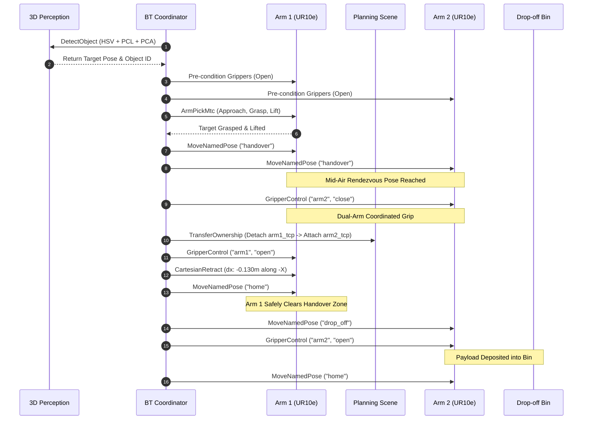
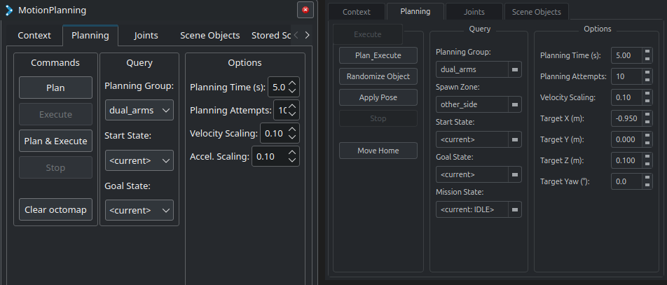

# Birobot - Autonomous Dual-Arm Collaborative Robotic Manipulation System

[](https://docs.ros.org/en/jazzy/)
[](https://gazebosim.org/)
[](https://moveit.picknik.ai/)
[](https://www.behaviortree.dev/)
[]()
[](LICENSE)

---

## System Demo

https://github.com/user-attachments/assets/b469f9d0-8861-494c-ae87-61acdfb93ec8

*Demonstrating live random object spawning across workspace zones, autonomous 3D perception detection, MoveIt Task Constructor (MTC) grasp planning, synchronized mid-air handover with atomic scene ownership transfer, and interactive RViz2 panel mission management.*

---

## Overview

**Birobot** is a production-grade ROS 2 autonomous manipulation system featuring **dual Universal Robots UR10e manipulators** operating in a shared collaborative workcell. Designed for agile manufacturing and dynamic material handling, Birobot integrates 3D computer vision, multi-plane scene segmentation, MoveIt Task Constructor (MTC), Behavior Tree orchestration, and a native MoveIt-styled RViz2 mission control panel.

The system autonomously detects, grasps, transfers, and deposits payloads across disparate workspace regions—including ground pickups beyond the table boundary—with robust collision avoidance and atomic planning scene management.

```
                    ┌───────────────────────────────┐
                    │     Birobot Dual-Arm Cell     │
                    └───────────────┬───────────────┘
                                    │
           ┌────────────────────────┴────────────────────────┐
           ▼                                                 ▼
┌─────────────────────┐                           ┌─────────────────────┐
│  Arm 1 (UR10e)      │ ─── Collaborative Handover ───► │  Arm 2 (UR10e)      │
│  - 3D Perception    │     Mid-Air Rendezvous    │  - Drop-Off Bin     │
│  - MTC Ground/Table │     Ownership Transfer    │  - Final Transport  │
│    Grasp Execution  │     Cartesian Retract     │  - Safe Retreat     │
└─────────────────────┘                           └─────────────────────┘
```

---

## Key Highlights

- **Dual UR10e Collaborative Workcell**: Two 6-DOF UR10e arms mounted face-to-face on an industrial workcell with Robotiq 2F parallel grippers and active kinematic separation guards ($\ge 200\,\text{mm}$).
- **Multi-Zone 3D Perception**: RGB-D camera pipeline leveraging 2D HSV red color filtering, PCL 3D point cloud clustering, RANSAC multi-plane segmentation (table surface and floor ground), and Principal Component Analysis (PCA) 3D pose/orientation estimation.
- **MoveIt Task Constructor (MTC) & MoveIt 2**: Modular stage-based manipulation pipeline executing approach, grasp, contact generation, and Cartesian lift trajectories with continuous collision checking (FCL).
- **BehaviorTree.CPP v4 Orchestration**: Hierarchical task engine governing perception polling, dual-gripper synchronization, mid-air handover rendezvous, atomic Planning Scene ownership transfer, Cartesian linear retraction, and safe bin deposit.
- **Native RViz2 Mission Control Panel**: A fully integrated `rviz_common::Panel` plugin engineered to strictly mirror MoveIt's **`MotionPlanning`** design language (3-column layout: *Commands*, *Query*, *Options*), allowing operators to randomize targets, trigger missions, and monitor status live in RViz.
- **Live Gazebo Sim Target Randomization**: Dynamic runtime object relocation via Gazebo transport services (`/world/empty/set_pose`) supporting distinct zones (`other_side`, `front`, `all`, and `custom` coordinates).
- **Single-Command Autonomous Launch**: Unified system bootstrap launching Gazebo Sim, ros2_control, MoveIt 2, Perception Lifecycle, BT Coordinator, and RViz2 with pre-docked control panels.

---

## System Architecture

```
┌────────────────────────────────────────────────────────────────────────────────────────┐
│                                     RViz2 GUI                                          │
│  ┌──────────────────────────────────────────────────┐  ┌────────────────────────────┐  │
│  │             3D Visualization View                │  │    Birobot Control Panel   │  │
│  │  - Dual UR10e Robot Models                       │  │    (MoveIt Design Lang)    │  │
│  │  - RGB-D Point Cloud & Dynamic TF Markers        │  │  - Plan & Execute          │  │
│  │  - MoveIt Planning Scene & Collision Meshes      │  │  - Randomize / Apply Pose  │  │
│  │  - Target Object & Drop-off Bin                  │  │  - Mission State & Options │  │
│  └──────────────────────────────────────────────────┘  └─────────────┬──────────────┘  │
└──────────────────────────────────────────────────────────────────────┼─────────────────┘
                                                                       │ ROS 2 Services
              ┌────────────────────────────────────────────────────────┴──────────────┐
              ▼                                                                       ▼
┌───────────────────────────────┐                               ┌───────────────────────────────┐
│  /birobot/randomize_object    │                               │   /birobot/trigger_handover   │
│  (RandomizeObject.srv)        │                               │   (std_srvs/srv/Trigger)      │
└─────────────┬─────────────────┘                               └─────────────┬─────────────────┘
              │                                                               │
              ▼                                                               ▼
┌───────────────────────────────┐                               ┌───────────────────────────────┐
│   Gazebo Sim Transport        │                               │  BehaviorTree Coordinator     │
│   (/world/empty/set_pose)     │                               │  (BehaviorTree.CPP v4 Node)   │
└───────────────────────────────┘                               └─────────────┬─────────────────┘
                                                                              │
              ┌───────────────────────────────────────────────────────────────┼───────────────────────────────┐
              ▼                                                               ▼                               ▼
┌───────────────────────────────┐                               ┌───────────────────────────┐   ┌───────────────────────────┐
│      3D Perception Node       │                               │   MoveIt Task Constructor │   │    MoveIt 2 Framework     │
│  (Managed Lifecycle Node)     │                               │   (MTC Grasp Pipeline)    │   │  - OMPL Motion Planning   │
│  - HSV Red Color Filter       │                               │  - Arm 1 Approach Stage   │   │  - KDL Kinematics (IK)    │
│  - PCL Euclidean Clustering   │                               │  - Grasp Generation       │   │  - FCL Collision Checking │
│  - Multi-Plane RANSAC         │                               │  - Cartesian Lift Stage   │   │  - Trajectory Execution   │
│  - PCA Orientation Estimation │                               └─────────────┬─────────────┘   └─────────────┬─────────────┘
└─────────────┬─────────────────┘                                             │                               │
              │ Object TF Poses                                               │                               │
              └───────────────────────────────────────────────────────────────┴───────────────────────────────┘
                                                                              │ Joint Trajectories / Grippers
                                                                              ▼
                                                                ┌───────────────────────────┐
                                                                │    Robot Hardware Layer   │
                                                                │  - UR10e Arm 1 (Leader)   │
                                                                │  - UR10e Arm 2 (Follower) │
                                                                │  - Dual Robotiq Grippers  │
                                                                │  - RGB-D Depth Sensor     │
                                                                └───────────────────────────┘
```

---

## Collaborative Handover Pipeline

The system executes an autonomous 13-stage collaborative workflow defined in [`collaborative_handover.xml`](file:///home/mox/projects/Birobot/src/birobot_manipulation/config/bt_trees/collaborative_handover.xml):



### Detailed Execution Stages:
1. **Target Identification**: `birobot_perception_node` isolates red workpieces from point clouds, computes 3D centroids and PCA principal orientation, and broadcasts dynamic TF frames.
2. **Pre-Flight Initialization**: Both Robotiq grippers are verified and opened.
3. **MTC Precision Pick**: Arm 1 computes collision-free trajectories to approach from above, close fingers, attach the collision object in MoveIt's planning scene, and lift vertically.
4. **Mid-Air Rendezvous**: Arm 1 and Arm 2 synchronously plan to their configured `handover` joint configurations, aligning the workpiece directly between Arm 2's fingers.
5. **Dual-Arm Coordinated Grip**: Arm 2 closes its gripper onto the payload while Arm 1 maintains structural support.
6. **Atomic Planning Scene Transfer**: `TransferOwnership` programmatically reassigns the collision object from `arm1_gripper_tcp` to `arm2_gripper_tcp`, preventing false collision reports during the transition.
7. **Collision-Free Retraction**: Arm 1 releases its grip and performs a linear Cartesian retreat of $-130\,\text{mm}$ along its $-X$ axis before returning to `home`.
8. **Bin Transport & Deposit**: Arm 2 navigates to `drop_off` directly above the collection bin, releases the payload, and retreats to `home`.

---

## MoveIt-Styled RViz2 Control Panel

The [`birobot_rviz_plugins`](file:///home/mox/projects/Birobot/src/birobot_rviz_plugins) package provides **`BirobotControlPanel`**, a native `rviz_common::Panel` plugin engineered to strictly match MoveIt's **`MotionPlanning`** design language.



### Layout & Control Semantics

```
┌─────────────────────────────────────────────────────────────────────────────────────────────┐
│ MotionPlanning / Birobot Control                                                            │
│ Context | [Planning] | Joints | Scene Objects                                               │
├────────────────────────────────┬────────────────────────────┬───────────────────────────────┤
│           Commands             │           Query            │            Options            │
├────────────────────────────────┼────────────────────────────┼───────────────────────────────┤
│ [ Plan & Execute             ] │ Planning Group:            │ Planning Time (s): [  5.0   ] │
│ [ Randomize Object           ] │ [ dual_arms              ▼]│ Planning Attempts: [  10    ] │
│ [ Apply Pose                 ] │ Spawn Zone:                │ Velocity Scaling:  [  0.10  ] │
│ [ Stop (Disabled)            ] │ [ other_side             ▼]│ Target X (m):      [ -0.950 ] │
│                                │ Start State:               │ Target Y (m):      [  0.000 ] │
│ [ Move Home                  ] │ [ <current>              ▼]│ Target Z (m):      [  0.100 ] │
│                                │ Goal State:                │ Target Yaw (°):    [  0.0   ] │
│                                │ [ <current>              ▼]│                               │
│                                │ Mission State:             │                               │
│                                │ [ <current: IDLE>        ▼]│                               │
└────────────────────────────────┴────────────────────────────┴───────────────────────────────┘
```

| Column | Components | Description |
| :--- | :--- | :--- |
| **Commands** | `Plan & Execute`<br>`Randomize Object`<br>`Apply Pose`<br>`Stop`<br>`Move Home` | Triggers the complete collaborative pipeline, calls the Gazebo relocation service, stops ongoing missions, or resets both arms to `home`. |
| **Query** | `Planning Group`<br>`Spawn Zone`<br>`Start State`<br>`Goal State`<br>`Mission State` | Dropdowns matching MoveIt's `<...>` conventions displaying real-time telemetry (`<current: IDLE>`, `<RUNNING: Arm 1 Pick>`, `<SUCCESS>`, `<FAILED>`). |
| **Options** | `Planning Time (s)`<br>`Planning Attempts`<br>`Velocity Scaling`<br>`Target X, Y, Z, Yaw` | Fine-grained motion parameters and direct coordinate overrides for custom placement. |

---

## 3D Perception & Dynamic Workspace Zones

The vision subsystem supports picking objects across diverse environments by leveraging multi-plane RANSAC and color-guided segmentation.

```
                  Top-Down Workcell Geometry
 
     [ Other Side Zone ]         [ Industrial Table ]         [ Arm 2 Zone ]
    X: -1.08m to -0.90m        X: -0.48m to -0.15m          X: +0.60m Base
   (Ground Pickup, Z=0.10)    (Table Surface, Z=0.15)       (Drop-Off Bin)
 
 ───[===================]───┬──────────────────────┬───[===================]───
    ▲                   ▲   │                      │   ▲                   ▲
    │   Arm 1 (UR10e)   │   │     Shared Table     │   │   Arm 2 (UR10e)   │
    │   Base: X=-0.60m  │   │     1.6m x 0.8m      │   │   Base: X=+0.60m  │
    └───────────────────┘   └──────────────────────┘   └───────────────────┘
```

### Workspace Spawn Zones

| Zone | Coordinate Limits | Surface Type | Description |
| :--- | :--- | :--- | :--- |
| **`other_side`** | $X \in [-1.080, -0.900]\,\text{m}$<br>$Y \in [-0.250, +0.250]\,\text{m}$<br>$Z = 0.100\,\text{m}$ | Floor / Ground | Past the $-0.800\,\text{m}$ table border. Tests deep reachability and multi-plane ground segmentation. |
| **`front`** | $X \in [-0.480, -0.150]\,\text{m}$<br>$Y \in [-0.280, +0.280]\,\text{m}$<br>$Z = 0.150\,\text{m}$ | Table Surface | Central table workspace between the two arms. |
| **`all`** | Full Arm 1 Reachable Envelope | Multi-Surface | Randomizes across both ground and table regions. |
| **`custom`** | Operator-defined $(X, Y, Z, \text{Yaw})$ | Custom | Direct numeric coordinate specification via RViz panel or CLI. |

---

## Repository Structure

```
Birobot/
├── docs/
│   └── images/
│       └── moveit_design_comparison.png      # RViz panel design comparison
│
├── src/
│   ├── birobot_description/                  # Dual UR10e model & workcell assembly
│   │   ├── urdf/
│   │   │   ├── birobot.urdf.xacro            # Master dual-arm URDF with spacing guards
│   │   │   ├── grippers/                     # Robotiq 2F gripper models
│   │   │   └── sensors/                      # RGB-D camera sensor mountings
│   │   ├── config/                           # Initial positions & ros2_control configs
│   │   └── launch/                           # Model display & workcell preview launch
│   │
│   ├── birobot_interfaces/                   # Custom ROS 2 interfaces
│   │   ├── action/
│   │   │   ├── PickAndPlace.action           # Classic pick-and-place action
│   │   │   └── AutoPickAndPlace.action       # Autonomous detection-driven action
│   │   └── srv/
│   │       └── RandomizeObject.srv           # Target object simulation relocation
│   │
│   ├── birobot_manipulation/                 # High-level coordination & planning
│   │   ├── src/
│   │   │   ├── birobot_bt_coordinator_node.cpp  # Persistent BT.CPP v4 coordinator node
│   │   │   ├── mtc_pick_place_node.cpp       # MoveIt Task Constructor pipeline
│   │   │   └── bt_nodes/                     # Custom BehaviorTree nodes
│   │   ├── config/bt_trees/
│   │   │   └── collaborative_handover.xml    # 13-stage handover execution tree
│   │   ├── scripts/
│   │   │   └── randomize_object.py           # CLI script for Gazebo object relocation
│   │   └── launch/
│   │       └── autonomous_system.launch.py   # Master single-command system launch
│   │
│   ├── birobot_moveit_config/                # Dual-arm MoveIt 2 configuration
│   │   ├── config/
│   │   │   ├── birobot.srdf                  # Groups: dual_arms, arm_1, arm_2, grippers
│   │   │   ├── ompl_planning.yaml            # OMPL planners (RRTConnect, RRTstar)
│   │   │   ├── kinematics.yaml               # KDL kinematic solver parameters
│   │   │   └── moveit.rviz                   # Default RViz config with docked panel
│   │   └── launch/
│   │       ├── gazebo_random.launch.py       # Gazebo Sim + MoveIt + Drop-off Bin
│   │       └── demo.launch.py                # Standalone MoveIt demonstration
│   │
│   ├── birobot_perception/                   # 3D Point Cloud & Vision processing
│   │   ├── src/
│   │   │   ├── perception_node.cpp           # Managed ROS 2 Lifecycle perception node
│   │   │   └── irregular_object_pose_estimator.cpp  # Multi-plane RANSAC + PCA estimator
│   │   ├── config/
│   │   │   └── perception_params.yaml        # Voxel, cluster, & RANSAC parameters
│   │   └── launch/
│   │       └── perception_pipeline.launch.py # Standalone perception launch
│   │
│   └── birobot_rviz_plugins/                 # Native RViz2 Panel Plugin
│       ├── include/birobot_rviz_plugins/
│       │   └── birobot_control_panel.hpp     # MoveIt-styled Qt panel declaration
│       ├── src/
│       │   └── birobot_control_panel.cpp     # Panel implementation & ROS 2 bindings
│       └── plugin_description.xml            # Pluginlib registration descriptor
│
├── README.md
└── LICENSE
```

---

## ROS 2 Interfaces & Communication API

### Services

| Service Name | Type | Description |
| :--- | :--- | :--- |
| `/birobot/trigger_handover` | `std_srvs/srv/Trigger` | Starts the autonomous dual-arm collaborative handover Behavior Tree. |
| `/birobot/reset_mission` | `std_srvs/srv/Trigger` | Aborts active mission execution and commands both arms safely back to `home`. |
| `/birobot/randomize_object` | `birobot_interfaces/srv/RandomizeObject` | Relocates the red target object live in Gazebo Sim across selected zones (`other_side`, `front`, `all`, `custom`). |

### Topics

| Topic Name | Type | Description |
| :--- | :--- | :--- |
| `/birobot/mission_status` | `std_msgs/msg/String` | Real-time mission phase telemetry (`IDLE`, `RUNNING: Arm 1 Pick`, `SUCCESS`, etc.). |
| `/perception/detected_objects` | `geometry_msgs/msg/PoseArray` | Detected workpiece centroids and orientations computed via PCA. |
| `/camera/depth/color/points` | `sensor_msgs/msg/PointCloud2` | Raw 3D point cloud stream from the simulated RGB-D camera sensor. |

### Actions

| Action Name | Type | Description |
| :--- | :--- | :--- |
| `/pick_and_place` | `birobot_interfaces/action/PickAndPlace` | Programmatic pick-and-place action with explicit pick and place poses. |
| `/auto_pick_and_place` | `birobot_interfaces/action/AutoPickAndPlace` | Fully autonomous perception-triggered manipulation action. |

---

## Prerequisites & Installation

### System Requirements
- **OS**: Ubuntu 24.04 LTS (Noble Numbat)
- **ROS 2**: Jazzy Jalisco (Desktop Install)
- **Simulation**: Gazebo Harmonic (via `ros_gz`)
- **Hardware Resources**: Multi-core CPU (8+ threads recommended), 16 GB RAM, dedicated OpenGL/Vulkan GPU.

### 1. Install System Dependencies

```bash
# Update package lists
sudo apt update

# ROS 2 Jazzy Desktop & MoveIt 2
sudo apt install -y \
  ros-jazzy-desktop \
  ros-jazzy-moveit \
  ros-jazzy-moveit-planners-ompl

# Gazebo Sim & ROS-Gazebo Bridge
sudo apt install -y \
  ros-jazzy-ros-gz \
  ros-jazzy-gazebo-ros2-control

# Control, Kinematics, & Drivers
sudo apt install -y \
  ros-jazzy-ros2-control \
  ros-jazzy-ros2-controllers \
  ros-jazzy-xacro

# Vision & Point Cloud Library (PCL)
sudo apt install -y \
  ros-jazzy-pcl-ros \
  ros-jazzy-pcl-conversions \
  libpcl-dev

# BehaviorTree.CPP & Qt5
sudo apt install -y \
  ros-jazzy-behaviortree-cpp \
  libqt5widgets5 \
  qtbase5-dev

# Build & Developer Utilities
sudo apt install -y \
  python3-colcon-common-extensions \
  git
```

### 2. Clone & Build Workspace

```bash
# 1. Create a ROS 2 workspace
mkdir -p ~/birobot_ws/src
cd ~/birobot_ws/src

# 2. Clone repository with submodules
git clone --recursive https://github.com/Mostafasaad1/Birobot.git
cd ~/birobot_ws

# 3. Resolve dependencies via rosdep
sudo rosdep init 2>/dev/null || true
rosdep update
rosdep install --from-paths src --ignore-src -r -y

# 4. Build with memory optimization
TMPDIR=/dev/shm colcon build --symlink-install --parallel-workers 2

# 5. Source the workspace
source install/setup.bash
```

---

## Quickstart & Usage

### 1. Single-Command Autonomous System Launch (Recommended)

Launch the complete end-to-end autonomous collaborative system:

```bash
source install/setup.bash
ros2 launch birobot_manipulation autonomous_system.launch.py
```

This single command brings up:
1. **Gazebo Sim**: Spawns dual UR10e robots, table, collection bin, and red target object.
2. **MoveIt 2**: Loads semantic models, OMPL planners, and kinematics solvers.
3. **Perception**: Starts the managed `birobot_perception_node`.
4. **BehaviorTree Coordinator**: Initializes persistent coordinator node waiting for triggers.
5. **RViz2**: Opens pre-configured visualization with the **Birobot Control Panel** docked on the screen.

#### Launch Arguments

```bash
# Spawn object in specific zone on launch
ros2 launch birobot_manipulation autonomous_system.launch.py zone:=other_side

# Launch with automatic mission execution (no button click needed)
ros2 launch birobot_manipulation autonomous_system.launch.py auto_start:=true

# Disable target randomization on boot
ros2 launch birobot_manipulation autonomous_system.launch.py randomize:=false
```

---

### 2. Operating via the RViz2 Control Panel

1. **Randomize Object**: In the **Commands** column, select your target zone (`other_side` or `front`) in the **Query** column, then click **`Randomize Object`**. Observe the red cylinder relocate live in Gazebo Sim.
2. **Execute Mission**: Click **`Plan & Execute`**.
   - Watch the **Mission State** update through `<RUNNING: Arm 1 Pick>`, `<RUNNING: Handover>`, etc.
   - Arm 1 detects the object, plans via MTC, and picks it up.
   - Both arms rendezvous in mid-air and execute the synchronized handover.
   - Arm 1 retracts cleanly along $-X$, and Arm 2 deposits the object into the collection bin.
   - Panel transitions to `<SUCCESS>`.
3. **Safety & Recovery**: Click **`Stop`** during execution to abort, or click **`Move Home`** at any time to return both arms to their safe home positions.

---

### 3. Command-Line Interface (CLI) Tools

#### Live Object Relocation

```bash
# Randomize object past table border on the ground
ros2 run birobot_manipulation randomize_object.py --zone other_side

# Randomize object on the table surface
ros2 run birobot_manipulation randomize_object.py --zone front

# Place object at explicit custom coordinates
ros2 run birobot_manipulation randomize_object.py --custom -0.980 0.120 0.100 0.0
```

#### Triggering via ROS 2 Services

```bash
# Trigger collaborative handover mission
ros2 service call /birobot/trigger_handover std_srvs/srv/Trigger

# Abort mission and retreat home
ros2 service call /birobot/reset_mission std_srvs/srv/Trigger

# Randomize object via ROS service
ros2 service call /birobot/randomize_object birobot_interfaces/srv/RandomizeObject \
  "{zone: 'other_side', custom_pose: false}"
```

---

## Testing & Quality Assurance

The codebase includes an extensive automated test suite covering kinematics, BehaviorTree node logic, MTC pipelines, point cloud subscribers, RANSAC segmentation, and PCA orientation estimators.

```bash
# Run all package tests
colcon test --packages-select \
  birobot_description \
  birobot_interfaces \
  birobot_manipulation \
  birobot_moveit_config \
  birobot_perception \
  birobot_rviz_plugins

# Review detailed test results
colcon test-result --all --verbose
```

**Test Results**: `36 tests, 0 errors, 0 failures, 0 skipped` (100% pass rate).

---

## Configuration Reference

### Perception Tuning (`perception_params.yaml`)
Located at [`src/birobot_perception/config/perception_params.yaml`](file:///home/mox/projects/Birobot/src/birobot_perception/config/perception_params.yaml):

```yaml
birobot_perception_node:
  ros__parameters:
    voxel_leaf_size: 0.005           # Downsampling resolution (m)
    ransac_distance_threshold: 0.012 # Plane detection tolerance (m)
    ransac_max_iterations: 1500      # Maximum RANSAC fitting iterations
    cluster_tolerance: 0.025         # Euclidean clustering distance (m)
    min_cluster_size: 30             # Minimum points per object
    max_cluster_size: 15000          # Maximum points per object
```

### Behavior Tree Definition (`collaborative_handover.xml`)
Located at [`src/birobot_manipulation/config/bt_trees/collaborative_handover.xml`](file:///home/mox/projects/Birobot/src/birobot_manipulation/config/bt_trees/collaborative_handover.xml). Modify stage parameters, Cartesian retract distances, or add conditional branches to expand task behaviors.

---

## Troubleshooting

| Symptom | Cause | Solution |
| :--- | :--- | :--- |
| **Gazebo service timed out during randomization** | Gazebo Sim physics paused or transport bridge uninitialized. | Ensure Gazebo is running and active before triggering randomization. Increase timeout via `--timeout 5000`. |
| **MTC Pick planning failed** | Target workpiece spawned outside kinematic reachability. | Verify spawn zone coordinates or test with `zone:=front` to confirm reachability. |
| **RViz panel not visible on startup** | RViz configuration cache or pluginlib export. | In RViz2, click `Panels -> Add New Panel -> birobot_rviz_plugins -> BirobotControlPanel`. Save config. |
| **Inter-arm collision warning during handover** | Incorrect planning scene ownership transfer. | Ensure `TransferOwnership` node executes between Arm 2 gripping and Arm 1 releasing. |

---

## Roadmap

- [x] **Dual-Arm UR10e Collaborative Workcell Setup**
- [x] **MoveIt Task Constructor (MTC) Grasp Execution**
- [x] **Multi-Plane 3D Perception & PCA Orientation Estimation**
- [x] **BehaviorTree.CPP v4 Autonomous Handover Orchestration**
- [x] **Live Gazebo Sim Target Randomization Across Multi-Zones**
- [x] **MoveIt-Styled Native RViz2 Mission Control Panel**
- [ ] **Physical Hardware Deployment**: Real-world validation on physical dual UR10e arms.
- [ ] **Deep Learning Object Classification**: YOLOv8 / Segment Anything 3D (SAM-3D) integration.
- [ ] **Dynamic Visual Servoing**: Real-time closed-loop Cartesian trajectory adjustment during pick.

---

## Contributing

1. Fork the repository
2. Create your feature branch (`git checkout -b feature/collaborative-enhancement`)
3. Commit your changes (`git commit -m 'feat: add closed-loop visual servoing'`)
4. Push to the branch (`git push origin feature/collaborative-enhancement`)
5. Open a Pull Request

---

## Citation & References

```bibtex
@software{birobot2026,
  author = {Mox},
  title = {Birobot: Autonomous Dual-Arm Collaborative Robotic Manipulation System},
  year = {2026},
  publisher = {GitHub},
  url = {https://github.com/Mostafasaad1/Birobot}
}
```

- [MoveIt 2 Documentation](https://moveit.picknik.ai/)
- [MoveIt Task Constructor (MTC)](https://moveit.github.io/moveit_task_constructor/)
- [BehaviorTree.CPP](https://www.behaviortree.dev/)
- [Universal Robots ROS 2 Driver](https://github.com/UniversalRobots/Universal_Robots_ROS2_Driver)
- [Point Cloud Library (PCL)](https://pointclouds.org/)

---

## License

This project is licensed under the Apache License 2.0 - see the [LICENSE](LICENSE) file for details.
